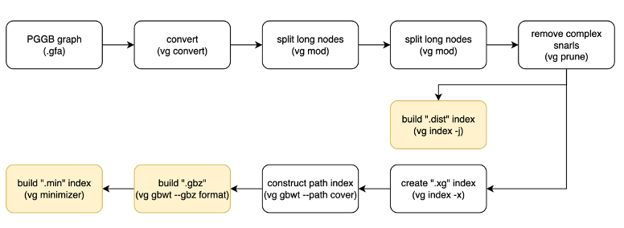

# Variant calling of short reads with the pangenome graph

## PanGenie

1. Index and run PanGenie using `scripts/run_pangenie.sh`
2. Merge the sample results using `scripts/pangenie/01_bcftools_merge.sh`
3. Separate the variant types using `scripts/pangenie/03_seperate_variants_v4.sh`
4. Remove homozygous variants using `scripts/pangenie/04_remove_homozygous.sh`

## VG

Indexing vg is quite complicated, because using vg autoindex will fail short reads alignment, hence we need to simplify the graph manually.

Below are the step processes that was done to index the graph with vg. Indexing was done per chromosomes. 

[vg_index_autosomes.sh](scripts/vg_giraffe/run_index.sh) and [vg_index_X.sh](scripts/vg_giraffe/run_index_X.sh)

    #!/bin/bash
    #SBATCH -p icelake
    #SBATCH -N 1
    #SBATCH -n 12
    #SBATCH --time=12:00:00
    #SBATCH --mem=128GB
    #SBATCH --array=1-23
    #SBATCH --ntasks-per-core=1
    set -euo pipefail

    date
    module purge
    module use /apps/modules/all
    module load Singularity/3.10.5
    module load SAMtools/1.17-GCC-11.2.0

    chr=$SLURM_ARRAY_TASK_ID
    gfa_dir=/hpcfs/groups/phoenix-hpc-avsci/Paulene_Pineda/buffalo_pangenome_v3/pggb/chr_${chr}_p95_s10k
    gfa=${gfa_dir}/chr_${chr}*.gfa
    echo "$gfa"

    for f in $gfa; do
        base_gfa=$(basename "$f" .gfa)
        echo "$base_gfa"
    done

    ### index graph
    echo "→ vg convert"
    singularity exec /hpcfs/groups/phoenix-hpc-avsci/Paulene_Pineda/buffalo_pangenome_v3/tools/vg_v1.64.0.sif vg \
    convert -g $gfa > "$base_gfa".vg

    echo "→ vg mod"
    singularity exec /hpcfs/groups/phoenix-hpc-avsci/Paulene_Pineda/buffalo_pangenome_v3/tools/vg_v1.64.0.sif vg \
    mod -X 256 "$base_gfa".vg > "$base_gfa".mod.vg

    echo "→ vg prune"
    singularity exec /hpcfs/groups/phoenix-hpc-avsci/Paulene_Pineda/buffalo_pangenome_v3/tools/vg_v1.64.0.sif vg \
    prune "$base_gfa".mod.vg -t 8 > "$base_gfa".pruned.vg

    echo "→ vg index gbwt"
    mkdir -p tmp_"$base_gfa"
    singularity exec /hpcfs/groups/phoenix-hpc-avsci/Paulene_Pineda/buffalo_pangenome_v3/tools/vg_v1.64.0.sif vg \
    index -x "$base_gfa".xg -g "$base_gfa".gbwt "$base_gfa".pruned.vg -t 8 -b tmp_"$base_gfa"

    echo "→ vg index dist"
    singularity exec /hpcfs/groups/phoenix-hpc-avsci/Paulene_Pineda/buffalo_pangenome_v3/tools/vg_v1.64.0.sif vg \
    index -j "$base_gfa".dist -t 8 "$base_gfa".pruned.vg

    echo "→ vg gbwt"
    singularity exec /hpcfs/groups/phoenix-hpc-avsci/Paulene_Pineda/buffalo_pangenome_v3/tools/vg_v1.64.0.sif vg \
    gbwt -x "$base_gfa".xg -o "$base_gfa".gbwt --path-cover --num-threads 8

    echo "→ vg gbwt gbz"
    singularity exec /hpcfs/groups/phoenix-hpc-avsci/Paulene_Pineda/buffalo_pangenome_v3/tools/vg_v1.64.0.sif vg \
    gbwt -x "$base_gfa".xg -g  "$base_gfa".gbz --gbz-format "$base_gfa".gbwt

    echo "→ vg minimizer"
    singularity exec /hpcfs/groups/phoenix-hpc-avsci/Paulene_Pineda/buffalo_pangenome_v3/tools/vg_v1.64.0.sif vg \
    minimizer -d "$base_gfa".dist --gbwt-name "$base_gfa".gbwt -o "$base_gfa".min "$base_gfa".mod.vg -t 8

    rm -r  tmp_"$base_gfa"

    echo "Done!"

After indexing the graph, variant calling was done using `scripts/vg_giraffe/run_vg_allsnarls_10xcov.sh`

Each vcf files were then [zipped](scripts/vg_giraffe/1_bgzip.sh), [concatenated](scripts/vg_giraffe/2_bcfconcat_v2.sh), [merged](scripts/vg_giraffe/3_bcfmerge_all.sh) and [variants separated](scripts/vg_giraffe/4_seperate_variants.sh).

Non-polymorphic variants were removed using `scripts/vg_giraffe/run_polymorphic.sh`.

## BWA MEM and GATK

`scripts/bwa_gatk`

1. Align samples using nextflow configs:   `nextflow run [main.nf](scripts/bwa_gatk/main_v1.nf)` with [nextflow.config](scripts/bwa_gatk/nextflow.config) and [samples](scripts/bwa_gatk/samples.tsv)